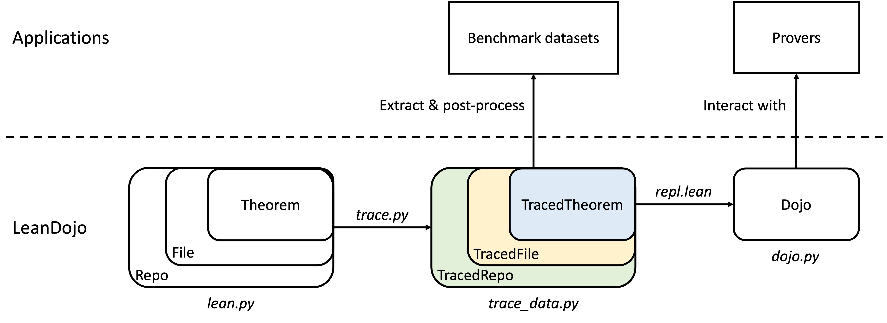
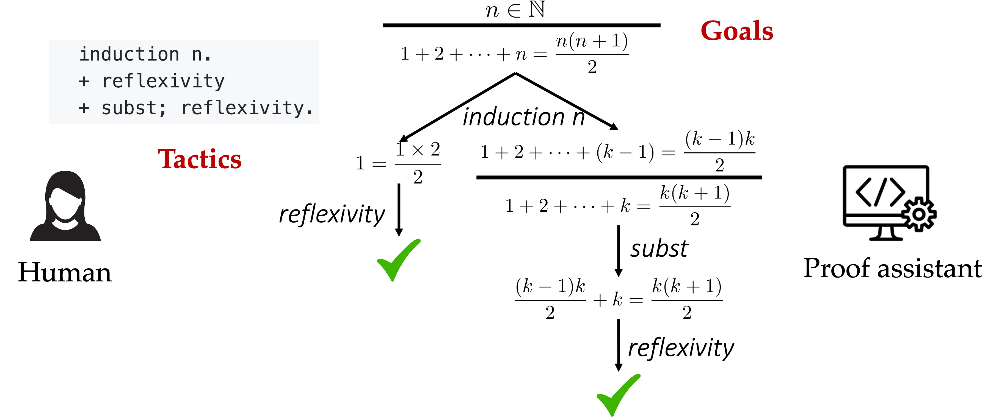

.. _user-guide:

User Guide
==========

Overview
********

Below is a high-level overview of LeanDojo. A Lean project is a Git repo 
consisting of multiple source files (:file:`*.lean`). Each file has
multiple theorems (and their proofs). Given a Lean repo, LeanDojo first traces it. 
The results are traced repo, files, and theorems with rich syntactic/semantic information not readily available in source code but useful
for downstream tasks, including but not limited to tactic states, tactics, and premises in tactics. 
Once we have traced repo/files/theorems, constructing datasets is simply a matter of post-processing.

Once a theorem is traced, LeanDojo enables us to interact with it by replacing the original, human-written proof with
a special :code:`repl` tactic. Unlike regular tactics transforming the goal in predefined ways, 
the :code:`repl` tactic reads tactics from an external prover, executes them in Lean, and reports the results back.
We name the resulting artifact Dojo (`道場 <https://en.wikipedia.org/wiki/Dojo>`_, the Japanese word for a gym for practicing martial arts).
Any external prover (potentially based on machine learning) can interact with Dojo to practice the art of theorem proving.

Next, we explain each concept in mode detail.

.. _lean-repo-and-files:

Lean Repos and Files
********************

We use `lean-liquid <https://github.com/leanprover-community/lean-liquid>`_ in Lean 3 as an example 
of Lean repos. It is a formalization of Peter Scholze's `Liquid Tensor Experiments <https://xenaproject.wordpress.com/2020/12/05/liquid-tensor-experiment/>`_.
Every Lean 3 repo has a config file :file:`leanpkg.toml` at its root. [#]_ For example, 

.. [#] ... unless the repo is `Lean <https://github.com/leanprover-community/lean>`_ itself, which LeanDojo handles for you but we'll not cover here.

.. code-block:: toml
   :caption: leanpkg.toml

   [package]
   name = "lean-liquid"
   version = "0.1"
   lean_version = "leanprover-community/lean:3.48.0"
   path = "src"

   [dependencies]
   mathlib = {git = "https://github.com/leanprover-community/mathlib", rev = "5947fb69cc1fdfebaba1e1b1f0a04f26f0f612bf"}

In the config file, :code:`lean_version` specifies the version of Lean this repo requires. :code:`path` specifies
the directory for Lean source files. And :code:`[dependencies]` tells us
the repo depends on a specific commit of `mathlib <https://github.com/leanprover-community/mathlib/tree/5947fb69cc1fdfebaba1e1b1f0a04f26f0f612bf>`__.
The repo can be compiled by running :code:`leanpkg build`, which performs two steps under the hood:

#. Run :code:`lean configure` to pull all dependencies (only mathlib here) into the :file:`_target/deps/` directory.
#. Run :code:`lean --make src` to compile the Lean source files (:file:`src` is configurable in :file:`leanpkg.toml`). Think of it as Lean's analogy of `GNU Make <https://www.gnu.org/software/make/>`_, which is smart enough to figure out dependencies.

For each :file:`*.lean` file, the compilation process checks all proofs in it 
and produces a :file:`*.olean` file (analogous to compiling :file:`*.cpp` to :file:`*.o`).
You may find more information about the toolchain of Lean 3 `here <https://leanprover-community.github.io/toolchain.html>`_ 
and related LeanDojo implementation in :ref:`lean_dojo.data_extraction.lean`.

Lean 4 uses a different build system ([lake](https://github.com/leanprover/lake)) 
with different configuration files and directory structures. However, the high-level idea is the same.

.. _theorems-and-proofs:

Theorems and Proofs
*******************

Theorems can be proved in Lean in multiple styles (term-style, tactic-style, mixed-style, etc.). 
We focus on tactic-style proofs. A proof is a sequence of tactics. Think of a tactic as 
a proof step. Each tactic transforms current goals into (hopefully simpler) sub-goals. And the proof 
is complete when all remaining goals become trivial. Below is an example of interacting 
with a proof assistant to prove the theorem about summing :math:`n` positive integers.

Initially, we know :math:`n \in \mathbb{N}` and want to prove :math:`1 + 2 + \dots + n = \frac{n (n + 1)}{2}`. 
We enter the tactic :code:`induction n` to reason by induction on the integer :math:`n`, which leads to two sub-goals, 
one corresponding to :math:`n = 0` and the other corresponding to :math:`n \gt 0`. Then we enter the tactic 
:code:`reflexivity` to prove the trivial case (:math:`n = 0`). Finally, we enter the tactic :code:`subst; reflexivity` 
to finish the proof. This process generates a proof tree whose nodes are tactic states (states for short) and whose edges 
are tactics. Each state has a goal (e.g., :math:`1 + 2 + \dots + n = \frac{n (n + 1)}{2}`) and a local context consisting of
hypotheses local to the goal (e.g., :math:`n \in \mathbb{N}`).

Theorems/proofs do not exist in isolation. When proving a theorem, we almost inevitably 
rely on existing theorems and definitions. Consider a simple example we've seen in :ref:`getting-started`:

.. code-block:: lean
  :caption: example.lean
  
  open nat (add_assoc add_comm)

  theorem hello_world (a b c : ℕ) : a + b + c = a + c + b :=
  begin
    rw [add_assoc, add_comm b, ←add_assoc]
  end

The tactic :code:`rw [add_assoc, add_comm b, ←add_assoc]` uses the premise :code:`add_assoc`, 
which is an existing theorem stating that the addition between natural numbers is associative 
(Similarly, :code:`add_comm` is about commutativity). Premise selection, i.e. generating the 
premises :code:`add_assoc` and :code:`add_comm`, is a major challenge in theorem proving (for 
both humans and machines). This is because the space of potentially useful premises is huge. 
In principle, it includes all existing math when we attempt to prove a new math theorem. In practice, 
there can be hundreds of thousands of potential premises, which cannot fit into the input window of 
any Transformer-based large language model. Therefore, it is difficult for these models to perform 
premise selection effectively when generating tactics.

We have presented a vastly simplified view of theorems and proofs in Lean. For more detail, Theorem Proving in Lean (`3 <https://leanprover.github.io/theorem_proving_in_lean/>`_, `4 <https://leanprover.github.io/theorem_proving_in_lean4/>`_)
is the definitive source. You may also refer to Sec. 3 of the LeanDojo paper. 
In LeanDojo, theorems are implemented by the :class:`lean_dojo.data_extraction.lean.Theorem` class.

.. _traced-repos:

Traced Repos
************

Conceptually, a traced repo is simply a collection of traced files. These files form a
directed acyclic graph (DAG) by importing each other. They include not only files from the target
repo but also dependencies that are actually used by the target repo. Taking `lean-liquid <https://github.com/leanprover-community/lean-liquid>`_ in Lean 3
as an example, it depends on `mathlib <https://github.com/leanprover-community/mathlib>`_ and `Lean's standard library <https://github.com/leanprover-community/lean/tree/master/library>`_.
The corresponding traced repo include all traced files from lean-liquid, as well as some 
files from mathlib and Lean's standard library that are actually used by lean-liquid.
After tracing finishes, these files are stored on the disk in the following directories:

::

   lean-liquid
   ├─src
   └─_target
     └─deps
       ├─lean
       │ └─library
       └─ mathlib

We call :file:`lean-liquid` the **root directory** of the traced repo.
Lean's standard library is in :file:`lean-liquid/_target/deps/lean/library`.
Source files of lean-liquid itself are in :file:`lean-liquid/src`.
Mathlib and other dependencies (if any) are in :file:`lean-liquid/_target/deps`.

In Lean 4, dependencies are storied in :file:`lake-packages` instead of :file:`_target/deps`.

In LeanDojo, traced repos are implemented by the :class:`lean_dojo.data_extraction.traced_data.TracedRepo` class.

.. _traced-files:

Traced Files
************

Tracing a :file:`*.lean` file generates the following files: 

* :file:`*.olean`: Lean's compiled object file. We're not concerned with them.
* :file:`*.dep_paths`: Paths of dependencies imported by the :file:`*.lean` file. We generate them using :code:`lean --deps` (Lean 3) or `ExtractData.lean <https://github.com/lean-dojo/LeanDojo/blob/main/src/lean_dojo/data_extraction/ExtractData.lean>`_ (Lean 4).
* :file:`*.ast.json`: AST of the :file:`*.lean` file annotated with semantic information such as tactic states and name resolutions. We generate them using :code:`lean --ast --tsast --tspp` (Lean 3) or `ExtractData.lean <https://github.com/lean-dojo/LeanDojo/blob/main/src/lean_dojo/data_extraction/ExtractData.lean>`_ (Lean 4). 
* :file:`*.trace.xml`: Syntactic and semantic information extracted from Lean. They are generated by post-processing :file:`*.dep_paths` and :file:`*.ast.json` files to organize the information in a nice way.

In LeanDojo, tracing is done by running `build_lean3_repo.py <https://github.com/lean-dojo/LeanDojo/blob/main/src/lean_dojo/data_extraction/build_lean3_repo.py>`_ 
with our `modified Lean 3 <https://github.com/lean-dojo/LeanDojo/blob/main/src/lean_dojo/data_extraction/0001-Modify-Lean-for-proof-recording.patch>`_ or 
`build_lean4_repo.py <https://github.com/lean-dojo/LeanDojo/blob/main/src/lean_dojo/data_extraction/build_lean4_repo.py>`_ with 
`ExtractData.lean <https://github.com/lean-dojo/LeanDojo/blob/main/src/lean_dojo/data_extraction/ExtractData.lean>`_
By default, we perform tracing in a `Docker container <https://github.com/lean-dojo/LeanDojo/blob/main/docker/Dockerfile>`_ (configurable via the :code:`CONTAINER` environment variable). 
Traced files are implemented by the :class:`lean_dojo.data_extraction.traced_data.TracedFile` class.

.. _traced-theorems:

Traced Theorems and Tactics
***************************

Traced theorems and tactics provide easy access to various information, such as the human-written
proof of a theorem, the number of tactics in a theorem, the premises used in a theorem/tactic, 
whether the theorem has a tactic-style proof, etc. Please refer to :class:`lean_dojo.data_extraction.traced_data.TracedTheorem`
and :class:`lean_dojo.data_extraction.traced_data.TracedTactic` for details.

.. _data-format:

Constructing Benchmark Datasets Using LeanDojo
**********************************************

Traced repos/files/theorems provide all information we need, and we can construct concrete 
machine learning datasets by some additional post-processing. See our examples of constructing 
datasets from `Lean 3's mathlib <https://github.com/lean-dojo/LeanDojo/blob/main/scripts/generate-benchmark-lean3.ipynb>`_ and `Lean 4's mathlib4 <https://github.com/lean-dojo/LeanDojo/blob/main/scripts/generate-benchmark-lean4.ipynb>`_.

Interacting with Lean
*********************

LeanDojo enables interacting with Lean programmatically using tactics. 
Please see the demos (`Lean 3 version <https://github.com/lean-dojo/LeanDojo/blob/main/scripts/demo-lean3.ipynb>`_, `Lean 4 version <https://github.com/lean-dojo/LeanDojo/blob/main/scripts/demo-lean4.ipynb>`_) and `dojo.py <https://github.com/lean-dojo/LeanDojo/blob/main/src/lean_dojo/interaction/dojo.py>`_.

.. _caching:

Caching
*******

Tracing large repos such as mathlib can take a long time (~1 hour if using 32 CPUs) and at least 32 GB memory.
Therefore, we trace the repo only once and cache the traced repo for fast access in the future.
The default cache directory is :file:`~/.cache/lean_dojo`, which can be configured through the :code:`CACHE_DIR` environment variable.
Traced repos in the cache are read-only, which prevents accidental modifications.  
You need :code:`chmod` if you want to, e.g., clean the cache. However, **refrain from manually modifying the cache while LeanDojo is running.**
It may lead to unpredictable behaviors, e.g., LeanDojo may attempt to refill the cache.

Traced repos in the cache are portable across machines. We host a number of them on `AWS S3 <https://lean-dojo.s3.amazonaws.com>`_, 
and LeanDojo will automatically download them if they are not in the local cache. To disable this behavior and 
build all repos locally, set the :code:`DISABLE_REMOTE_CACHE` environment variable to any value.

The caching mechanism in LeanDojo is implemented in `cache.py <https://github.com/lean-dojo/LeanDojo/blob/main/src/lean_dojo/data_extraction/cache.py>`_

.. _environment-variables:

Environment Variables
*********************

LeanDojo's behavior can be configured through the following environment variables:

* :code:`CACHE_DIR`: Cache directory (see :ref:`caching`). Default to :file:`~/.cache/lean_dojo`.
* :code:`DISABLE_REMOTE_CACHE`: Whether to disable remote caching and build all repos locally. Not set by default.
* :code:`TMP_DIR`: Temporary directory used by LeanDojo for storing intermediate files. Default to the systems' global temporary directory.
* :code:`NUM_PROCS`: Number of parallel processes for data extraction. Default to 32 or the number of CPUs (whichever is smaller).
* :code:`TACTIC_TIMEOUT`: Maximum time (in milliseconds) before interrupting a tactic when interacting with Lean (only applicable to Lean 3). Default to 5000.
* :code:`CONTAINER`: The container used for running LeanDojo. Default to :code:`native`, i.e., running without any container, but also supports :code:`docker`. See :ref:`running-within-docker`.
* :code:`TACTIC_CPU_LIMIT`: Number of CPUs for executing tactics (see the `--cpus` flag of `docker run <https://docs.docker.com/engine/reference/commandline/run/#memory>`_) when interacting with Lean (only applicable when :code:`CONTAINER=docker`). Default to 1.
* :code:`TACTIC_MEMORY_LIMIT`: Maximum memory when interacting with Lean (see the `--memory` flag of `docker run <https://docs.docker.com/engine/reference/commandline/run/#memory>`_) (only applicable when :code:`CONTAINER=docker`). Default to 16 GB.
* :code:`GITHUB_ACCESS_TOKEN`: GitHub `personal access token <https://docs.github.com/en/authentication/keeping-your-account-and-data-secure/managing-your-personal-access-tokens#creating-a-personal-access-token-classic>`_ for using the GitHub API. They are optional. If provided, they can increase the `API rate limit <https://docs.github.com/en/rest/overview/resources-in-the-rest-api#rate-limiting>`_.
* :code:`LOAD_USED_PACKAGES_ONLY`: Setting it to any value will cause LeanDojo to load only the dependency files that are actually used by the target repo. Otherwise, for Lean 4, it will load all files in the dependency repos. Not set by default.
* :code:`VERBOSE` or :code:`DEBUG`: Setting either of them to any value will cause LeanDojo to print debug information. Not set by default.

LeanDojo supports `python-dotenv <https://pypi.org/project/python-dotenv/>`_. You can use it to manage environment variables in a :file:`.env` file.

.. _running-within-docker:

Running within Docker (Important for Lean 3) 
********************************************

By default, LeanDojo performs data extraction and interaction by running Lean directly (:code:`CONTAINER=native`). 
However, this may be problematic for Lean 3, as LeanDojo builds a modified version of Lean 3 from its C++ code, which requires certain dependencies that can be hard to get right.
Therefore, if you use LeanDojo with Lean 3, we strongly recommend setting the environment variable :code:`CONTAINER` to :code:`docker`, which instructs LeanDojo to run relevant parts in a Docker container.
You will need Docker installed on your machine, but you do not need to build or launch Docker containers manually. LeanDojo will do it for you.

That said, there are scenarios where running within Docker is not an option, e.g., 
when you are on a remote server that does not have Docker installed, or 
when your server requires wrapping the entire job as a Docker container and you want to 
avoid the troubles caused by `running Docker within Docker <https://stackoverflow.com/questions/27879713/is-it-ok-to-run-docker-from-inside-docker>`_.

If you want to use LeanDojo with Lean 3 but cannot use Docker, follow these steps to run it without Docker:

* See if you can follow the CMake instructions to build `Lean 3 <https://github.com/leanprover-community/lean/blob/master/doc/make/index.md#generic-build-instructions>`_ from source. Resolve any dependency issues.
* Make sure you can build the Lean 3 repo you want by :code:`leanpkg build`.

Questions and Bugs
******************

* For general questions and discussions, please use `GitHub Discussions <https://github.com/lean-dojo/LeanDojo/discussions>`_.  
* To report a potential bug, please open an issue. In the issue, please include your OS information, the exact steps to reproduce the error, and complete logs in debug mode (setting the environment variable :code:`VERBOSE` to 1). The more details you provide, the better we will be able to help you. 
